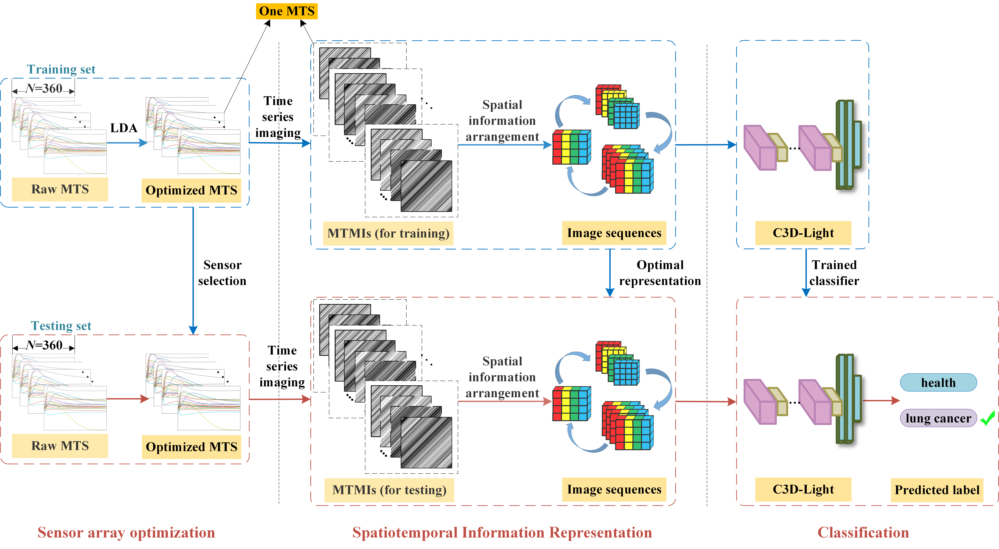

# SIR-3DCNN: A Framework of Multivariate Time Series Classification for Lung Cancer Detection


## Overview
This repository contains the code and resources for the paper **"SIR-3DCNN: A Framework of Multivariate Time Series Classification for Lung Cancer Detection"**. The project introduces a novel framework that combines Sensor Array Optimization, Spatiotemporal Information Representation, and a 3D Convolutional Neural Network (3DCNN) to classify multivariate time series data for early detection of lung cancer.

## Table of Contents

- [Project Structure](#project-structure)
- [Installation](#installation)
- [Usage](#usage)
  - [Sensor Array Optimization](#sensor-array-optimization)
  - [Spatiotemporal Information Representation](#spatiotemporal-information-representation)
  - [Classification](#classification)
- [Reference](#reference)


## Project Structure
- **classification/**: Contains scripts for building and training the 3DCNN model.
  - `models.py`: Defines the architecture of the 3DCNN.
  - `train.py`: Training script for the model.
- **media/**: Contains images and diagrams.
  - `framework.png`: Visual representation of the framework.
- **sensor_array_optimization/**: Includes scripts and results for sensor selection.
  - `SAO_LDA.py`: Performs sensor array optimization using LDA.
  - `array_optimization_result.txt`: Results of the sensor optimization.
- **spatiotemporal_information_representation/**: Scripts for data transformation.
  - `SIA.py`: Obtains the optimal spatiotemporal representation.
- **metrics.py**: Contains functions for evaluating model performance.
- **README.md**: Project documentation.

## Installation

### Prerequisites

- Python 3.7 or higher
- Required Python packages listed in `requirements.txt`

### Steps

1. **Clone the repository**

   ```bash
   git clone https://github.com/cqu-3dteam/sir-3dcnn.git
2. **Install dependencies**
   ```bash
   cd sir-3dcnn

   pip install -r requirements.txt

## Usage

### Sensor Array Optimization
```bash
python sensor_array_optimization/SAO_LDA.py
```

### Spatiotemporal Information Representation
```bash
python spatiotemporal_information_representation/SIA.py
```
### Classification

```bash
python classification/train.py
```

## Reference
```
@ARTICLE{SIR-3DCNN,
  author={Ran Liu, Shidan Wang, Fengchun Tian, Lin Yi},
  journal={IEEE Transactions on Instrumentation and Measurement}, 
  title={SIR-3DCNN: A Framework of Multivariate Time Series Classification for Lung Cancer Detection}, 
  year={2024},
  volume={},
  number={},
  pages={},
  doi={}
}
```
